# Cybersecurity Homelab

## Overview

This repository documents my personal cybersecurity homelab built to gain hands-on experience in networking, system administration, security monitoring, malware analysis, and digital forensics.

The lab is designed to replicate a structured enterprise and attack environment, enabling controlled interaction between attacker, target, and monitoring systems. This lab serves as a foundation for developing detection, monitoring, and incident response scenarios.

---

## Why This Lab Matters

This lab bridges the gap between theoretical cybersecurity knowledge and practical implementation. It provides a controlled environment to understand how systems communicate, how attacks are executed, and how monitoring tools provide visibility into system activity.

---

## Objectives

* Build a safe environment for cybersecurity practice
* Strengthen networking and system administration skills
* Practice offensive and defensive security workflows
* Centralize logs using Splunk
* Learn malware analysis and DFIR tools

---

## Lab Environment

### Virtualization

* Oracle VirtualBox

### Network & Firewall

* pfSense

### Offensive Security

* Kali Linux

### Vulnerable Machines

* Metasploitable
* Chronos

### Enterprise Environment

* Windows Server (Active Directory)
* Windows 11 Enterprise

### Malware Analysis

* FLARE VM
* REMnux

### DFIR

* Tsurugi Linux

### Monitoring

* Ubuntu + Splunk

---

## Network Diagram

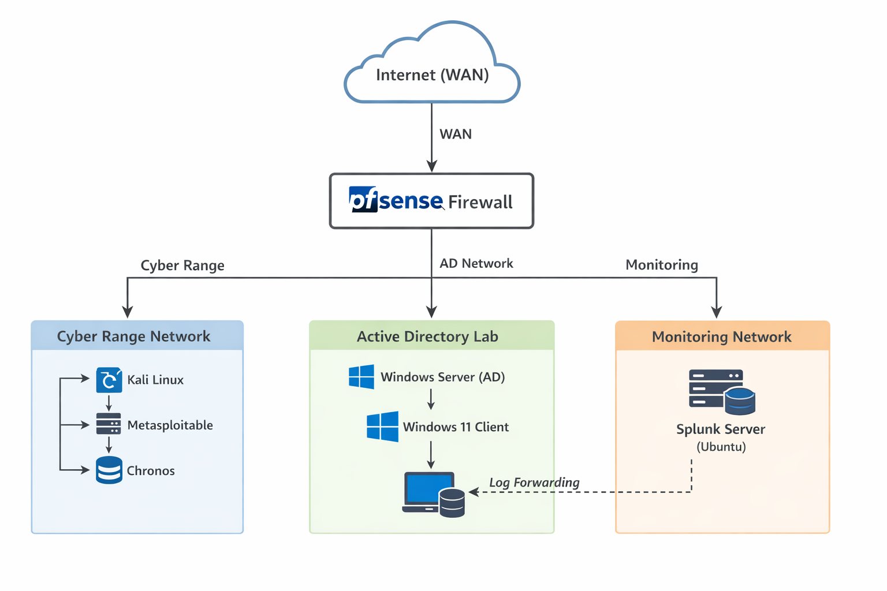

This diagram illustrates the architecture of the homelab, showing how pfSense segments traffic between the cyber range, enterprise environment, and monitoring systems.

---

## Architecture Summary

The lab is structured around pfSense acting as the central firewall, segmenting traffic between three primary zones:

* **Cyber Range**: attacker and vulnerable machines (Kali Linux, Metasploitable, Chronos)
* **Active Directory Lab**: enterprise environment (Windows Server and Windows 11)
* **Monitoring Network**: centralized logging using Splunk

This segmentation enables controlled testing of communication, access control, and monitoring workflows.

---

## Skills Practiced

* Virtualization
* Network configuration
* Firewall management
* Active Directory setup
* Linux administration
* Log monitoring
* Basic threat detection
* Malware analysis fundamentals
* Digital forensics and incident response fundamentals

---

## Key Learnings

* Understood how to design a segmented network using pfSense
* Gained hands-on experience with firewall rule configuration and traffic control
* Built and managed an Active Directory environment
* Established communication between attacker and target machines
* Deployed Splunk and configured log forwarding
* Learned the importance of visibility and monitoring in a lab environment

---

## Lab Screenshots & Validation

### VirtualBox Lab Environment

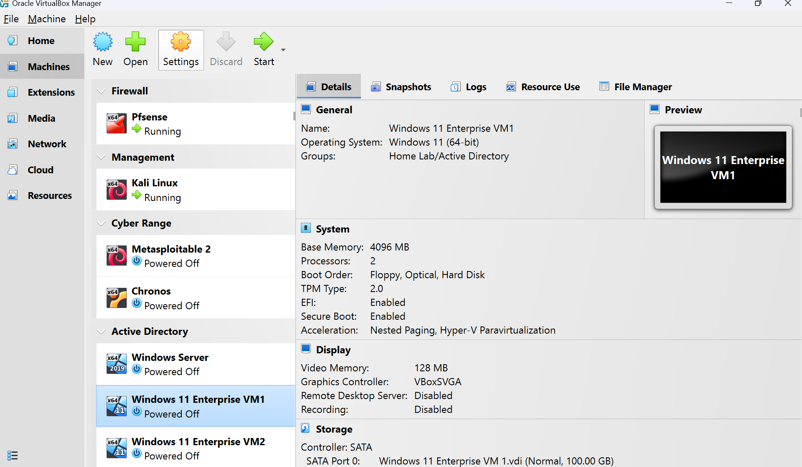
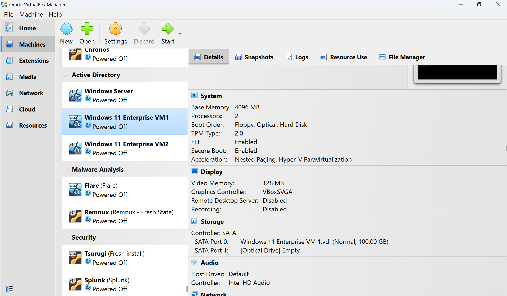

These screenshots show all virtual machines used in the lab environment, validating the multi-system setup.

---

### pfSense Firewall Configuration

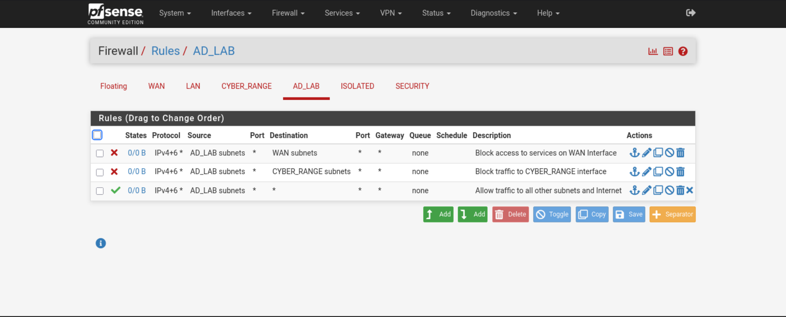
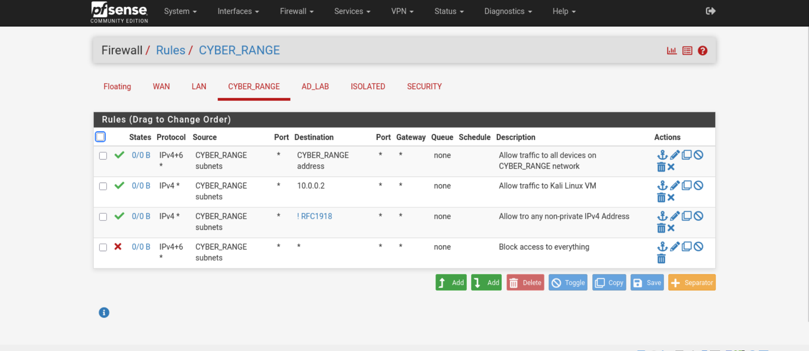
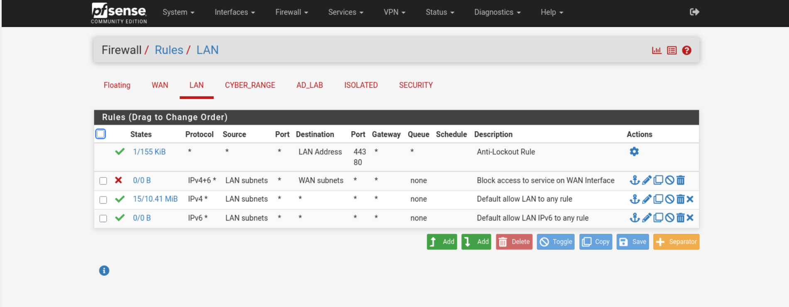
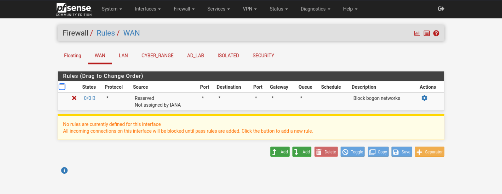

These demonstrate firewall rules configured in pfSense to control traffic between different network segments.

---

### pfSense Dashboard & Console

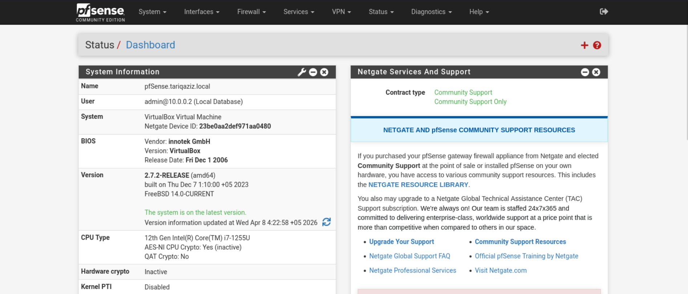
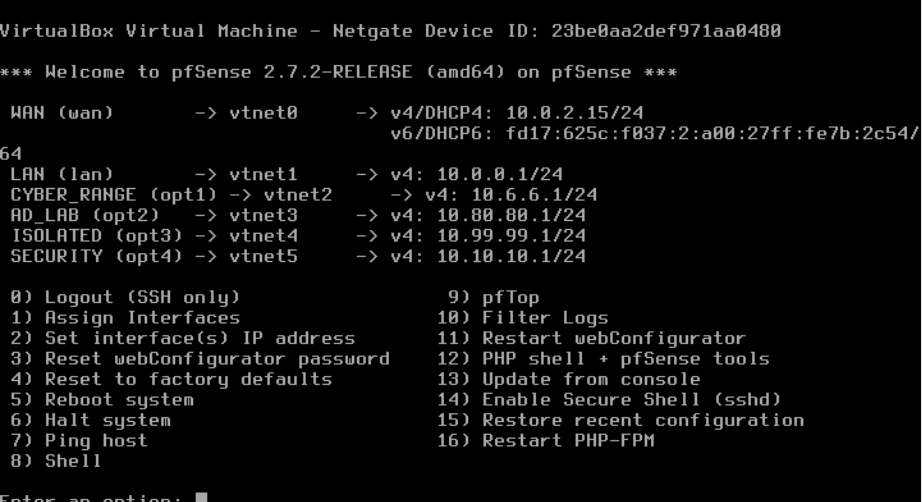

These validate that pfSense is deployed and functioning as the core firewall/router.

---

### Kali to Metasploitable Connectivity

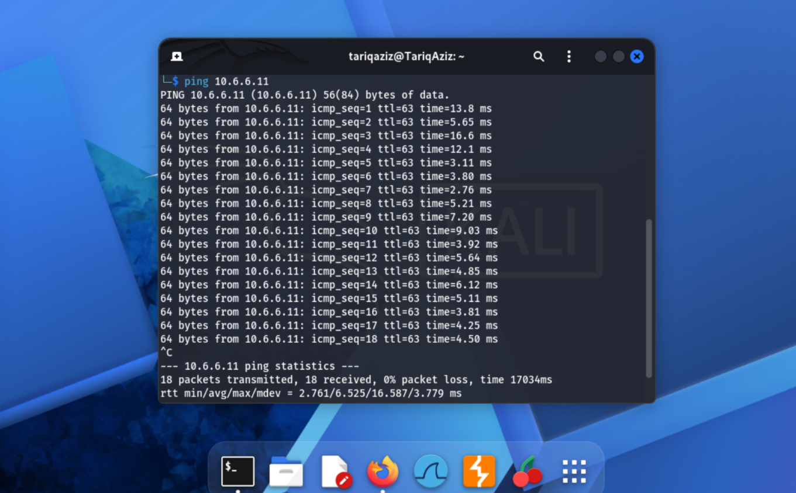

This confirms successful communication between attacker and target machines.

---

### Active Directory Dashboard

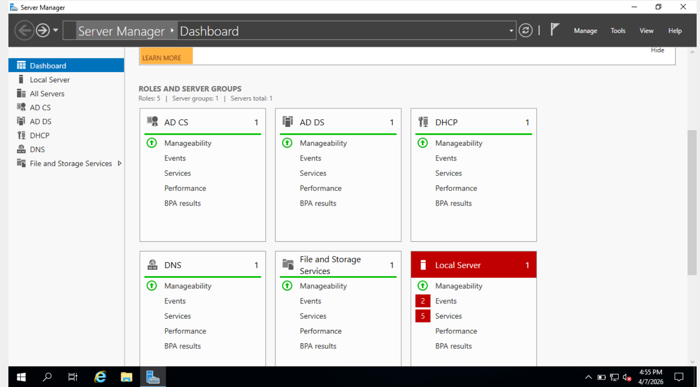

This shows the Active Directory setup for centralized identity management.

---

### Splunk Monitoring

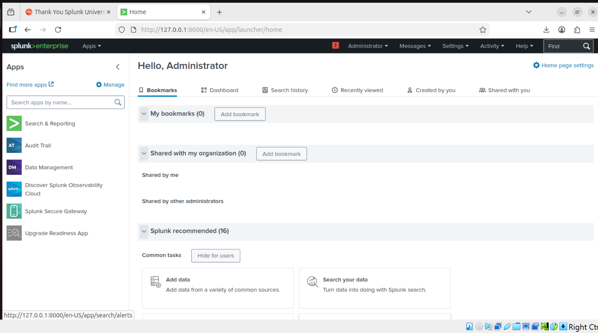
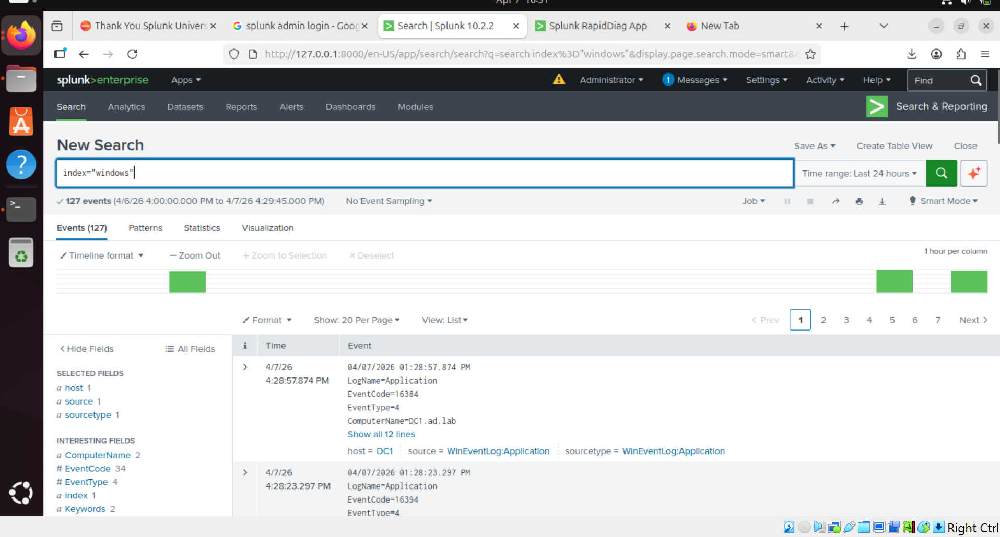

These confirm that Splunk is running and successfully receiving forwarded log data.

---


## Repository Structure

```
.
├── diagrams/
├── docs/
├── screenshots/
└── README.md
```


## Future Improvements

* Improve log forwarding and normalization in Splunk
* Analyze Windows authentication events for suspicious login behavior
* Simulate attack scenarios within the lab
* Expand monitoring and detection use cases
* Document investigation workflows and findings

---

## Disclaimer

This lab is created for educational purposes only and is fully isolated.
